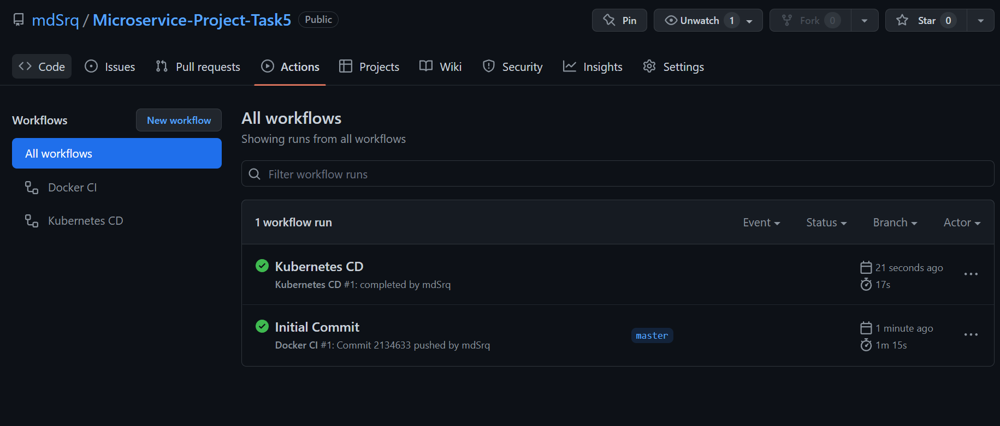

# Microservice-Project-Task5
Create a CI-CD pipeline using any CI-CD tool of your choice like Jenkins, Azure DevOps, Gitlab, Github Actions, AWS CodePipeline or any other tool of your choice. 
Include a code build and a docker build step in your pipeline.
## CI-CD Pineline using GitHub Actions   
  - [X] Code build and Docker build steps are taken care of in the Dockerfile which uses Multi-Stage Build.
  - [docker-ci.yml](./.github/workflows/docker-ci.yml) contains GitHub Actions for performing Docker build and pushes the image to docker hub.
  - [kubernetes-cd.yml](./.github/workflows/kubernetes-cd.yml) contains GitHub Actions to deploy the image to kubernetes cluster after the Docker CI workflow is completed.   
  
Required Secrets:
 - DOCKER_HUB_USERNAME : Docker Hub username.
 - DOCKER_HUB_ACCESS_TOKEN : Access token generated by docker hub.
 - KUBE_CONFIG : base64 encoded .kube/config file
    
      
Screenshot of workflows:   

  
